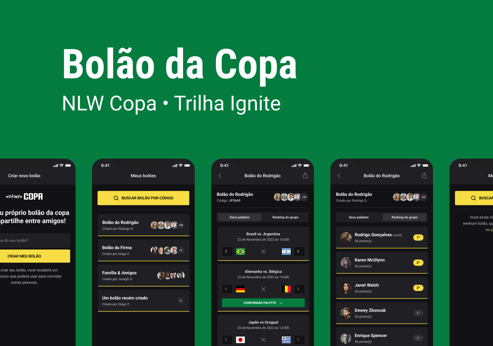

<!-- @format -->

<div align="center">

# ⚽ Copa

**Full-stack World Cup prediction pool (bolão) — API, web and mobile in one monorepo**



[](https://nodejs.org)
[](https://www.fastify.io)
[](https://www.prisma.io)
[](https://nextjs.org)
[](https://reactnative.dev)
[](https://expo.dev)
[](./LICENSE)

</div>

## 📖 About

Copa lets a group of friends create a pool for a soccer tournament, invite people with a shareable code, guess the score of every match, and follow a live leaderboard ranked by how close each guess is to the real result. The project is a monorepo with three independent apps that share the same API:

- **`server`** — REST API (Fastify + Prisma) that owns pools, participants, guesses and matches.
- **`web`** — Next.js app to create a pool and see its ranking from the browser.
- **`mobile`** — React Native (Expo) app where participants log in with Google and submit their guesses.

It was originally built during Rocketseat's **Next Level Week Copa**, and has been kept as a reference for shipping one product across backend, web and mobile with a shared data model.

## ✨ Features

- Create a pool and get a unique invite code
- Join a pool with an invite code
- Google sign-in on mobile (Expo Auth Session)
- Guess the score for every match of the tournament
- Per-pool ranking based on how accurate each guess was
- Seeded match data via Prisma

## 🛠 Tech Stack

| App | Stack |
| --- | --- |
| `server` | Node.js, TypeScript, Fastify, Prisma, Zod, JWT |
| `web` | Next.js, React, TypeScript, Tailwind CSS, Axios |
| `mobile` | React Native, Expo, Native Base, React Navigation |

## 🚀 Getting Started

Clone the repository:

```bash
git clone https://github.com/allanaramont/copa.git
cd copa
```

### Server

```bash
cd server
npm i
npx prisma migrate dev
npm run dev
```

### Web

```bash
cd web
npm i
npm run dev
```

### Mobile

Create a `.env` file inside `mobile` with your [Google Client ID](https://docs.expo.dev/guides/authentication/#google):

```bash
cd mobile
cp .env.example .env
npm i
npx expo start
```

## 🎨 Layout

Web and mobile designs are available on [Figma](https://www.figma.com/community/file/1169028343875283461).

## 📄 License

Distributed under the [MIT License](./LICENSE).

---

<div align="center">

Built by <a href="https://github.com/allanaramont">Allan Monteiro</a>

</div>
